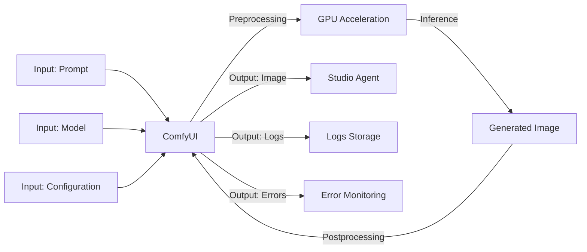

# ComfyUI Data Flow

```mermaid
graph LR
    A[Input: Prompt] --> B[ComfyUI]
    C[Input: Model] --> B
    D[Input: Configuration] --> B
    B -->|Preprocessing| E[GPU Acceleration]
    E -->|Inference| F[Generated Image]
    F -->|Postprocessing| B
    B -->|Output: Image| G[Studio Agent]
    B -->|Output: Logs| H[Logs Storage]
    B -->|Output: Errors| I[Error Monitoring]
```