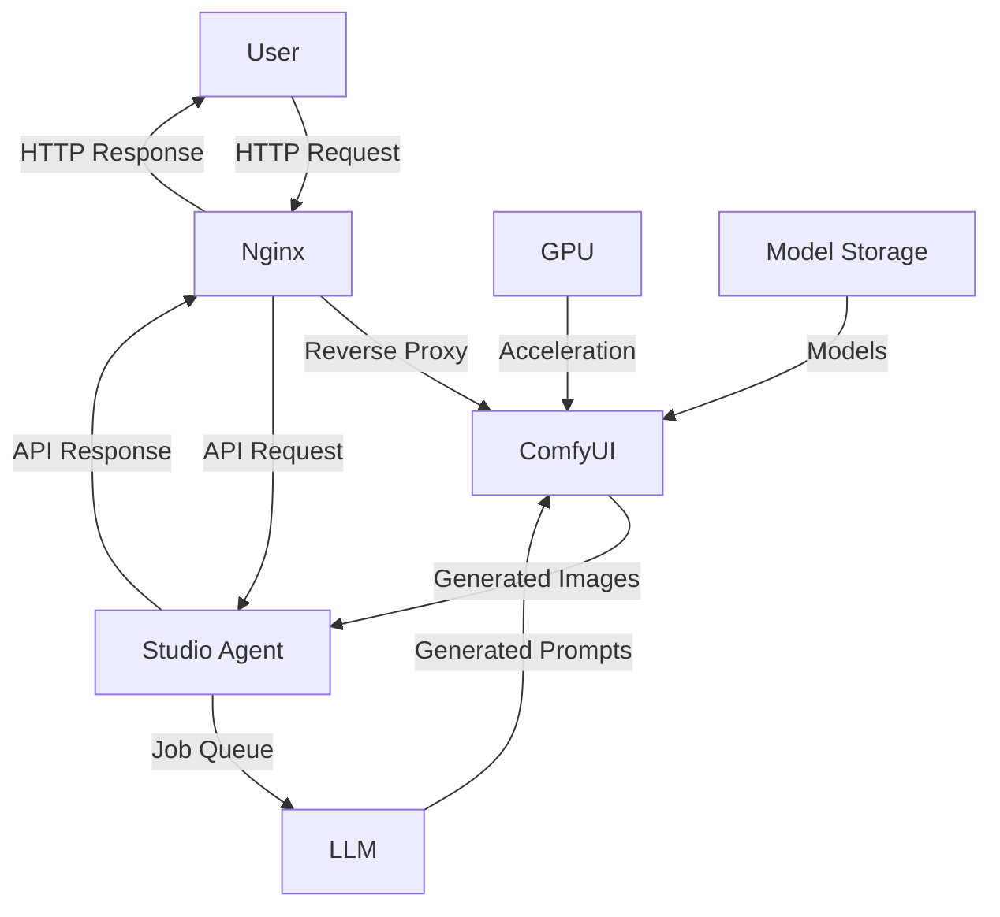

# High-Level Architecture

```mermaid
graph TD
    A[User] -->|HTTP Request| B[Nginx]
    B -->|Reverse Proxy| C[ComfyUI]
    B -->|API Request| D[Studio Agent]
    D -->|Job Queue| E[LLM]
    E -->|Generated Prompts| C
    C -->|Generated Images| D
    D -->|API Response| B
    B -->|HTTP Response| A
    F[GPU] -->|Acceleration| C
    G[Model Storage] -->|Models| C
```