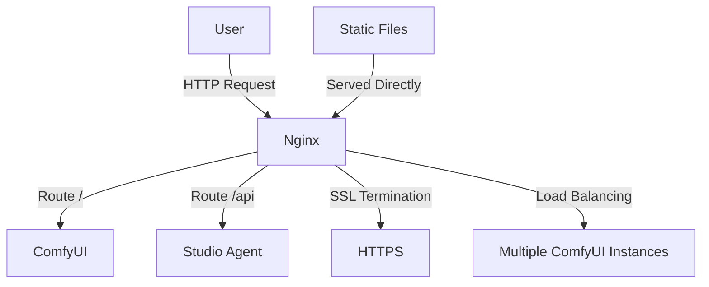

# Nginx Configuration

```mermaid
graph TD
    A[User] -->|HTTP Request| B[Nginx]
    B -->|Route /| C[ComfyUI]
    B -->|Route /api| D[Studio Agent]
    B -->|SSL Termination| E[HTTPS]
    B -->|Load Balancing| F[Multiple ComfyUI Instances]
    G[Static Files] -->|Served Directly| B
```