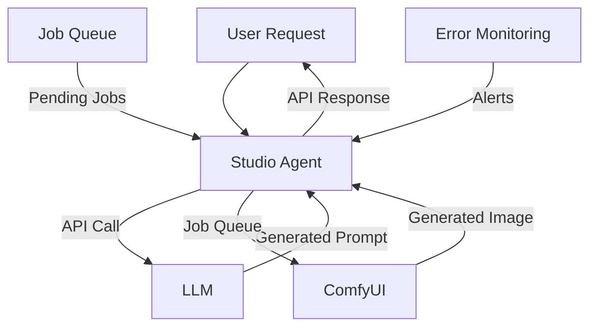

# Studio Agent Workflow

```mermaid
graph TD
    A[User Request] --> B[Studio Agent]
    B -->|API Call| C[LLM]
    C -->|Generated Prompt| B
    B -->|Job Queue| D[ComfyUI]
    D -->|Generated Image| B
    B -->|API Response| A
    E[Job Queue] -->|Pending Jobs| B
    F[Error Monitoring] -->|Alerts| B
```